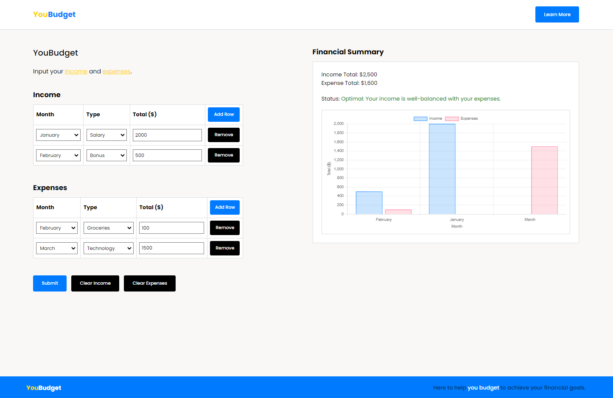

# YouBudget: Budgeting Web App

## Overview
YouBudget is an income and expense tracking application that allows users to input their financial data, assess their financial status, and visualize monthly spending trends through an interactive graph.

## Preview
  

[Watch the YouBudget Demo](https://drive.google.com/file/d/1_kqwVw7wXfkSyyDnvHQCHVFXmjjXPdLl/view?usp=sharing)

## Usage
- Users can select a transaction month and type from a dropdown menu.
- Users can remove specific rows or clear all rows from the table with a single click.
- A "Learn More" button directs users to Ontario Tech University's budgeting resource page.
- Input validation prevents the submission of empty budgets and alerts users when attempting to clear an empty table.

## Technologies Used
Java, JavaScript, HTML, CSS, RESTful API, Chart.js, Git

## Contributors
- Reshawn Lofters ([GitHub](https://github.com/reshawnlofters))
- Jonathan Purai ([GitHub](https://github.com/Jonathan432164))
- Meron Daniel ([GitHub](https://github.com/MeronDaniel))
- Abdellatif Osman ([GitHub](https://github.com/tef-o))

## Resources
- [Chart.js](https://www.chartjs.org): Used for creating bar graphs and visualizations in the application.
- [Ontario Tech University Budgeting Resource](https://safa.ontariotechu.ca/resources/budgeting.php): A resource for learning more about budgeting.

## Disclaimer
This project was developed as part of an academic course at Ontario Tech University. The code is not publicly available to maintain academic integrity.
