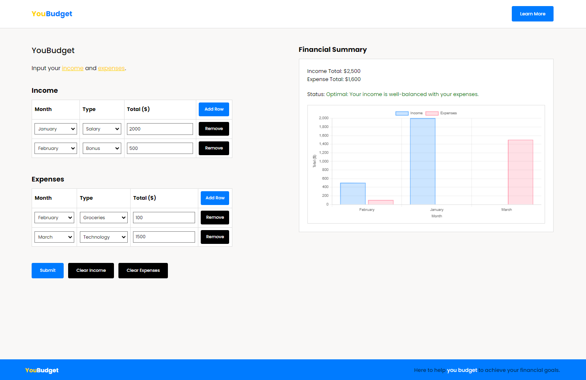

# YouBudget: Income and Expense Tracker

## Overview
YouBudget is a budgeting web app that allows users to log income and expenses, visualize monthly transactions through an interactive graph, and gain insights into their financial health.

## Preview
  

Watch the YouBudget Demo [here](https://drive.google.com/file/d/1_kqwVw7wXfkSyyDnvHQCHVFXmjjXPdLl/view?usp=sharing).

## Usage
- Select a transaction month and type from the dropdown menu.
- Remove specific rows or clear all rows from the table with a single click.
- Click the "Learn More" button to access Ontario Tech University's budgeting resources.
- Input validation prevents submission of empty budgets and alerts users when attempting to clear an empty table.

## Technologies Used
Java, JavaScript, Chart.js, HTML/CSS, REST API, Git

## Contributors
- Reshawn Lofters ([GitHub](https://github.com/reshawnlofters))
- Jonathan Purai ([GitHub](https://github.com/Jonathan432164))
- Meron Daniel ([GitHub](https://github.com/MeronDaniel))
- Abdellatif Osman ([GitHub](https://github.com/tef-o))

## Resources
- [Chart.js](https://www.chartjs.org): Used for creating bar graphs and visualizations in the application.
- [Ontario Tech University Budgeting](https://safa.ontariotechu.ca/resources/budgeting.php): A resource for learning more about budgeting.

## Disclaimer
This project was developed as part of an academic course at Ontario Tech University. The code is not publicly available to maintain academic integrity.
